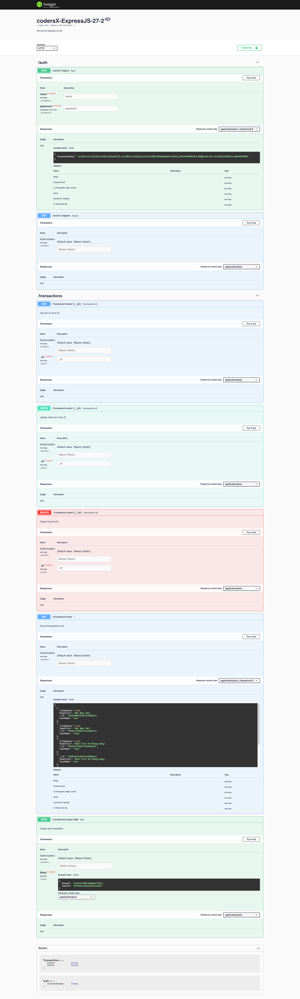

# codersX-ExpressJS-27-3
### BÀI 3
Nghiên cứu Swagger để viết API documentation gửi cho anh bạn mobile engineer kia. Lưu lại những gì bạn viết vào một file gist và submit.

Bài làm lần 1 full chức năng  :D&nbsp; tương tự ở [link gist này](https://gist.github.com/longpos222/f48b01d34f371d72e55d039e09791dc9).

=============================
[Link Gist Bài làm](https://gist.github.com/longpos222/036e54ad1a8db2ccc02c6af23009cfb7)

**Screenshot Documenter:**

