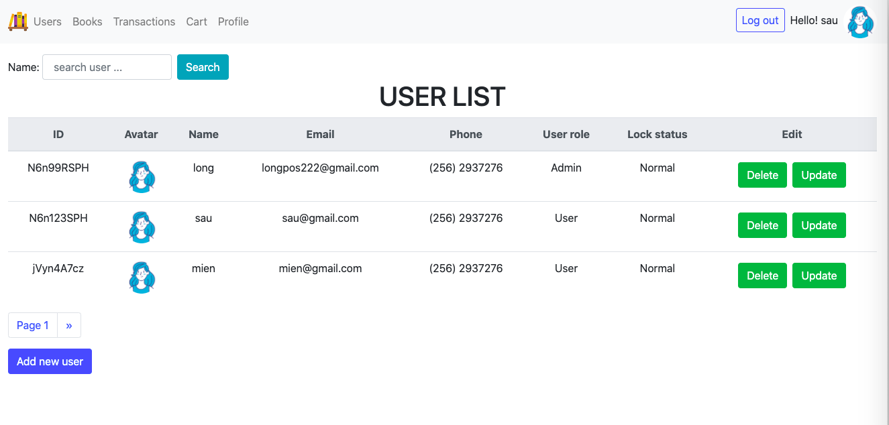
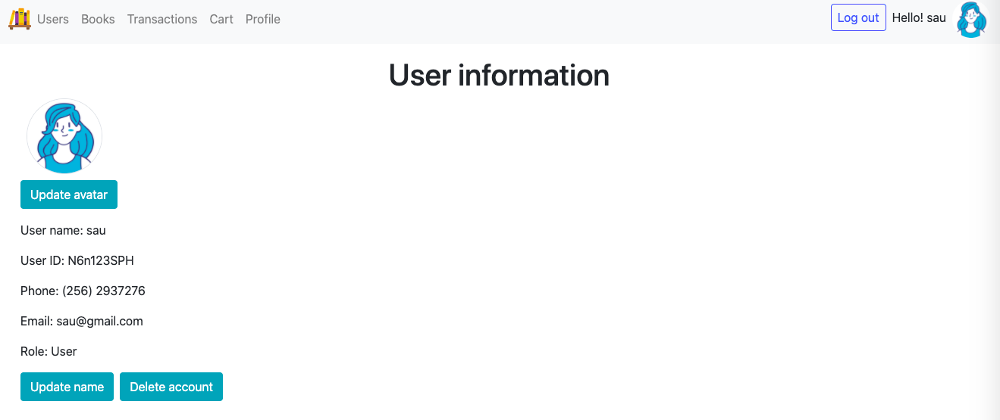
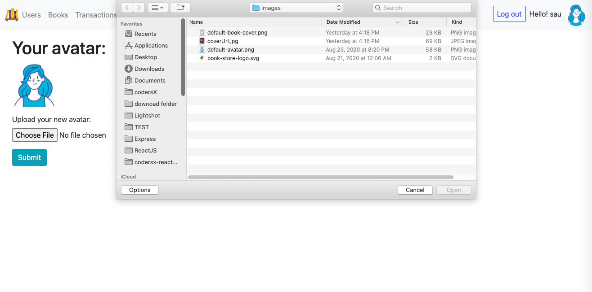

# codersX-ExpressJS-22
### BÀI 1

Bạn quyết định biến trang `/books` thành một trang không cần đăng nhập để người dùng có thể tự do xem bạn có sách gì để thuê, khi họ thấy hứng thú thì họ mới quyết định tạo tài khoản.
1) Biến trang `/books` thành public
2) Tạo bìa sách cho mỗi cuốn sách (gợi ý: `coverUrl`, dùng file upload)
3) Làm chức năng thêm sách vào giỏ trước khi đăng nhập và giữ nguyên trong giỏ sau khi đã đăng nhập
4) Nút thuê sách khi ấn vào thì toàn bộ sách sẽ được chuyển thành các `transaction`
***********************
__Update:__ Re-design UI using Bootstrap.
***********************
__Update:__ Add some screenshots, :grin: I know it look ugly but proudly made by me.:four_leaf_clover::four_leaf_clover::four_leaf_clover:
1.

2.

3.
