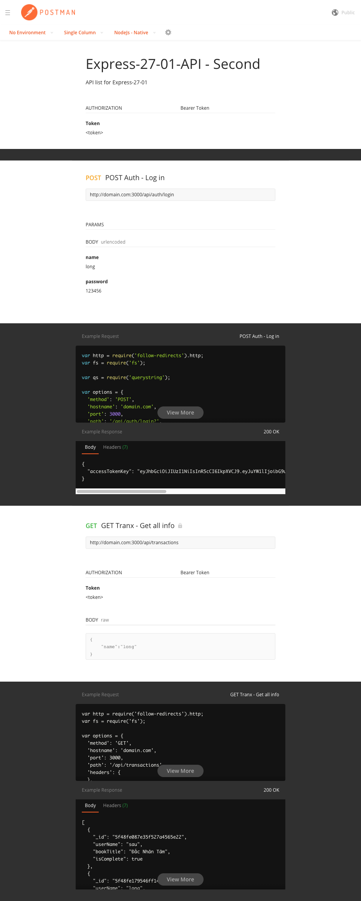

# codersX-ExpressJS-27-1
### BÀI 1
Sau khi đã chạy bản web một thời gian, bạn nghĩ đến việc làm app cho mobile, bạn thuê được một anh chàng làm mobile từ Silicon Valley, bạn đảm nhận phần REST API.
Hai bên lên plan và quyết định chỉ làm 2 tính năng: đăng nhập + xem các transaction.
Áp dụng kiến thức đã học ở bài REST API để tạo ra các endpoint sau:

`POST` `/api/login`
`GET` `/api/transactions`

=============================
[Link POSTMAN](https://documenter.getpostman.com/view/12247621/TVCcXpX9)

Screenshot Documenter:  

