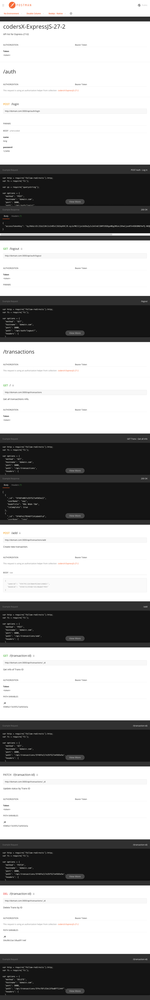

# codersX-ExpressJS-27-2
### BÀI 2 
Bạn quyết định làm đầy đủ chức năng cho mobile app. Hãy viết các endpoint còn lại theo suy nghĩ của bạn.
### API list:
Resource|POST create|GET read|PATCH update|DELETE delete|
:-|:-:|:-:|:-:|:-:|
`/auth/login`|log in|-|-|-|
`/auth/logout`|log out|-|-|-|
`/transactions`|add new |get all|-|-|
`/transactions/{tranx-id}`|-|get info|update status|delete|

Do bị làm lại lần thứ 2 :scream: :scream: :scream:  &nbsp; nên chỉ làm phần function `transactions`, `users` và `books` cũng khá tương tự. Ai quỡn có thể xem bài làm lần 1 full không che chức năng  :D&nbsp; tương tự ở [link github này](https://github.com/longpos222/codersX-Express-27-2).

=============================
[Link POSTMAN](https://documenter.getpostman.com/view/12247621/TVCcZVmy)

**Screenshot Documenter:**

